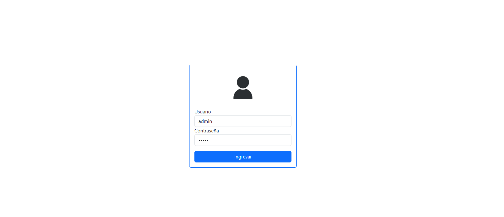
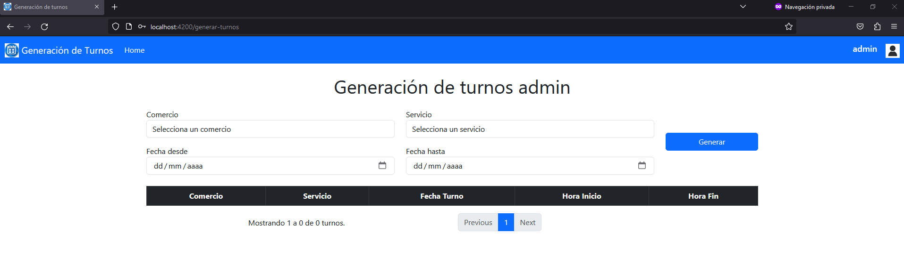
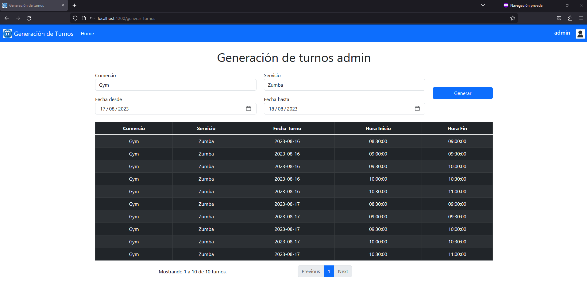

# Sistema de generación de turnos

## Descripción

Solución de agendamiento de turnos para que los clientes de varios comercios puedan reservar con anticipación un espacio
de atención en un servicio específico que presta cada comercio.







## Requisitos

- Node.js y npm.
- Angular CLI.

## Instalación

1. Clona este repositorio:
    ```bash
    git clone https://github.com/lchaconw/generacion-turnos-front
    cd generacion-turnos-front
    ```

2. Instala las dependencias:
    ```bash
    npm install
    ```

3. Ejecuta el servidor de desarrollo:
    ```bash
    ng serve -o
    ```

Abre tu navegador y visita `http://localhost:4200/`.

## Características

- **Login:** Iniciar sesión con usuario y contraseña.
- **Generación turnos:** Escoger comercio, servicio y fechas y horarios para generar los turnos y muestra el listado de
  turnos generados.
